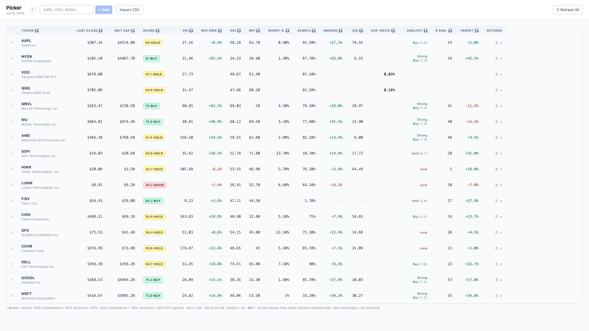
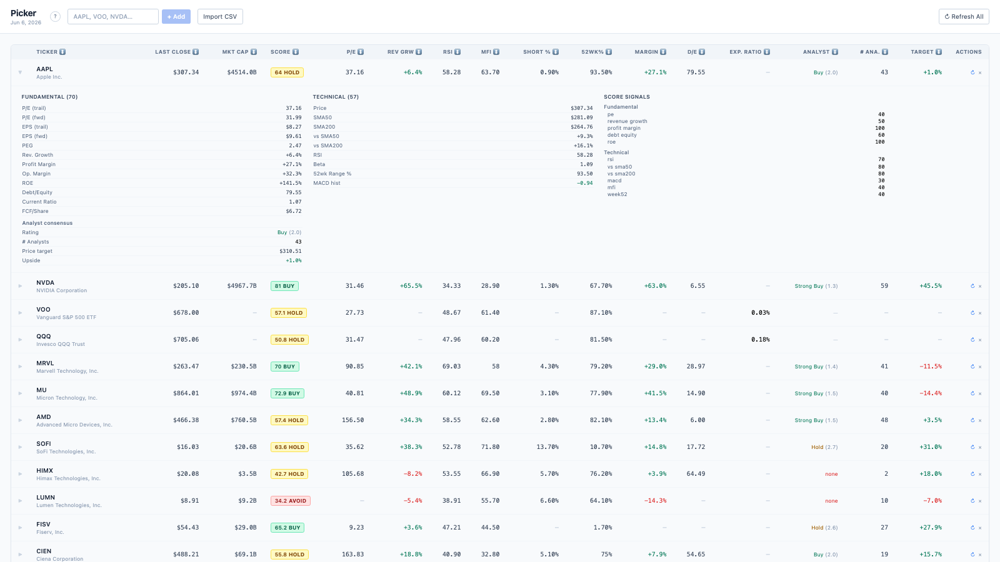

# Picker

A personal web app for evaluating stocks and ETFs side-by-side. Enter tickers manually or import a CSV, and get a scored watchlist with fundamental, technical, and ETF-specific metrics.





## Features

- **Composite score** — weighted 0–100 score with BUY / HOLD / AVOID verdict per ticker
- **Fundamental metrics** — P/E, EPS, revenue growth, profit margin, ROE, debt/equity, FCF
- **Technical metrics** — SMA50/200, RSI, MACD, 52-week range position, beta
- **ETF-specific metrics** — expense ratio, AUM, dividend yield, top 10 holdings
- **Holdings overlap** — pairwise overlap % between ETFs in your watchlist
- **Analyst consensus** — average analyst rating (Strong Buy → Sell), analyst count, mean price target, and % upside to target
- **Expandable rows** — click any row for a full metric + score signal breakdown
- **Score explainer** — `?` button documents dimension weights and every signal's thresholds
- **Comma-separated input** — add multiple tickers at once: `AAPL, VOO, NVDA`
- **CSV import** — drag-and-drop a file with a `ticker` column to bulk-add
- **Persistent watchlist** — saved to `~/.picker/watchlist.json`

## Columns

| Column | Stocks | ETFs | Notes |
|---|---|---|---|
| Score | ✓ | ✓ | Composite 0–100, BUY/HOLD/AVOID |
| P/E | ✓ | ✓ | Trailing P/E |
| Rev Grw | ✓ | — | YoY revenue growth |
| RSI | ✓ | ✓ | 14-day RSI |
| 52wk% | ✓ | ✓ | Position in 52-week range |
| Margin | ✓ | — | Profit margin |
| D/E | ✓ | — | Debt/equity ratio |
| Exp. Ratio | — | ✓ | Appears when any ETF is in the watchlist |
| Analyst | ✓ | — | Avg. rating label + numeric scale |
| # Ana. | ✓ | — | Number of covering analysts |
| Target | ✓ | — | % upside to mean price target |

## Stack

| Layer | Tech |
|---|---|
| Backend | Python 3.9+, FastAPI, yfinance |
| Frontend | React 18, TypeScript, Vite, Tailwind CSS |
| Data | Yahoo Finance (free, no key) + optional Alpha Vantage |

## Getting started

### 1. Backend

```bash
cd backend
python3 -m venv .venv
source .venv/bin/activate
pip install -r requirements.txt
cp .env.example .env          # optionally add ALPHA_VANTAGE_KEY
uvicorn main:app --reload --port 8000
```

### 2. Frontend

```bash
cd frontend
npm install
npm run dev                   # http://localhost:5173
```

### Or just use the start script

```bash
./start.sh
```

Starts both servers. Frontend proxies API calls to `localhost:8000` so no CORS config needed in the browser.

## Alpha Vantage (optional)

Get a free key at [alphavantage.co](https://www.alphavantage.co/support/#api-key) and add it to `backend/.env`:

```
ALPHA_VANTAGE_KEY=your_key_here
```

Without it, RSI and MACD fall back to calculations from yfinance price history — results are essentially the same.

## Scoring

| Dimension | Stock weight | ETF weight |
|---|---|---|
| Fundamental | 55% | 40% |
| Technical | 45% | 35% |
| ETF-specific | — | 25% |

Scores map to verdicts: **BUY** ≥ 65 · **HOLD** 40–64 · **AVOID** < 40.

Analyst data (rating, count, price target) is shown as additional context but does **not** feed into the composite score. Click `?` in the app for a full breakdown of every signal and its thresholds.

## CSV import format

```csv
ticker,notes
AAPL,core holding
VOO,broad market
QQQ,tech tilt
```

The `notes` column is optional.
